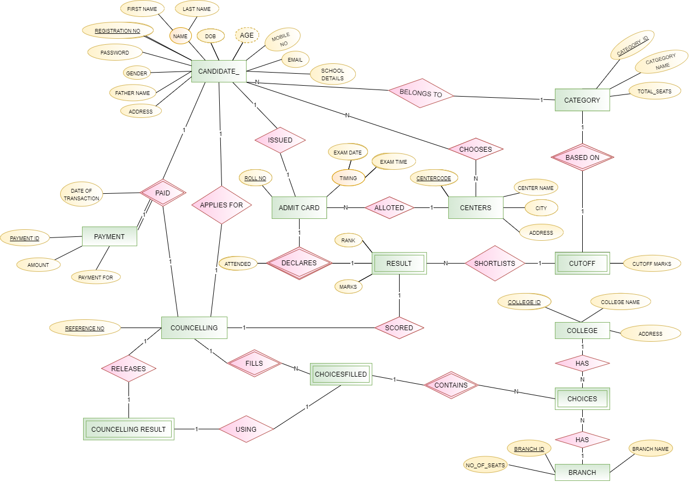
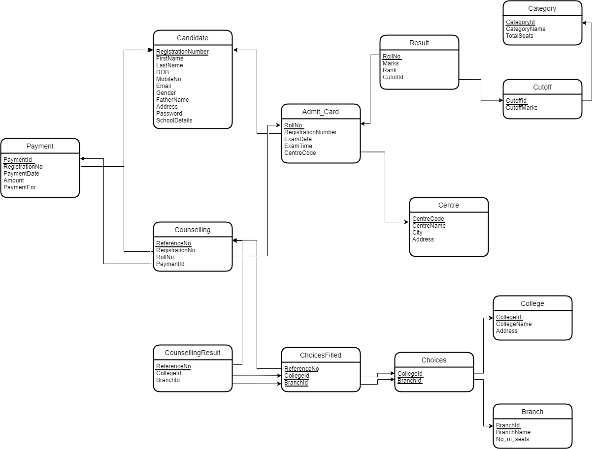

## JOSSA LITE

Database management system to store and manage almost all the important information about a student's registration and counselling process for an entrance exam. 

The Database will contain important information about the students and will be accessible to counselling authorities and the student himself. 

There are 13 entities persent in this database design, and it is normalised upto Boyce–Codd normal form (BCNF). All the relations are shown in pdf.

### ER Diagram

### Relational Schema
